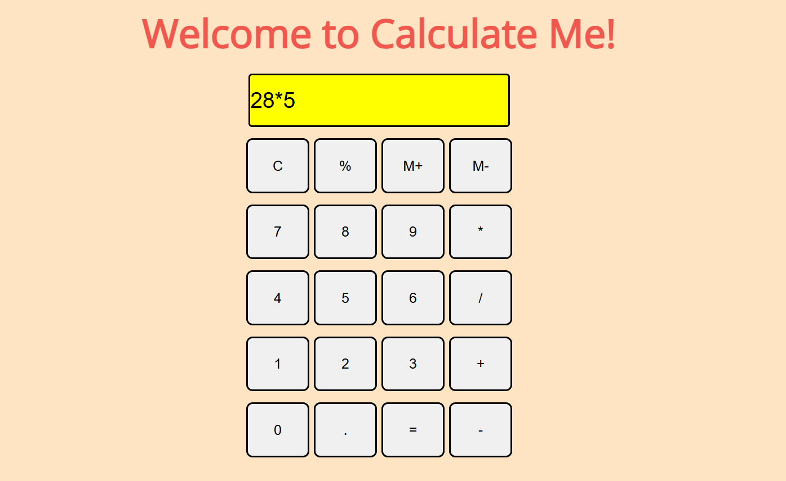

# Calculator 
This Calculator Project is a fully functional, user-friendly web application built using HTML, CSS, and JavaScript. The calculator provides essential arithmetic operations such as addition, subtraction, multiplication, and division. The app features a sleek, responsive design, ensuring usability across various devices and screen sizes. JavaScript handles the calculator's logic, ensuring accurate real-time calculations, while CSS provides an intuitive and visually appealing interface. This project serves as a great example of implementing core web development skills and demonstrates how to combine functionality and design to create a practical, interactive application.
## Live on : https://ayushisinha1719.github.io/Calculator/

